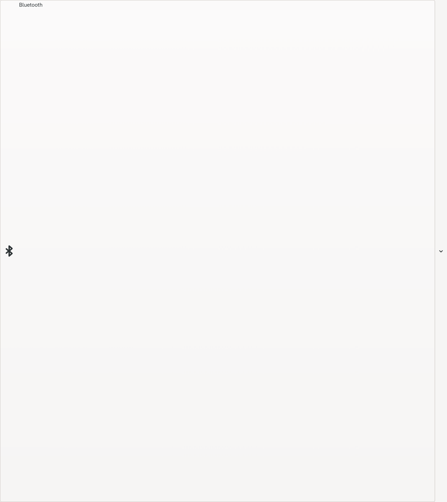
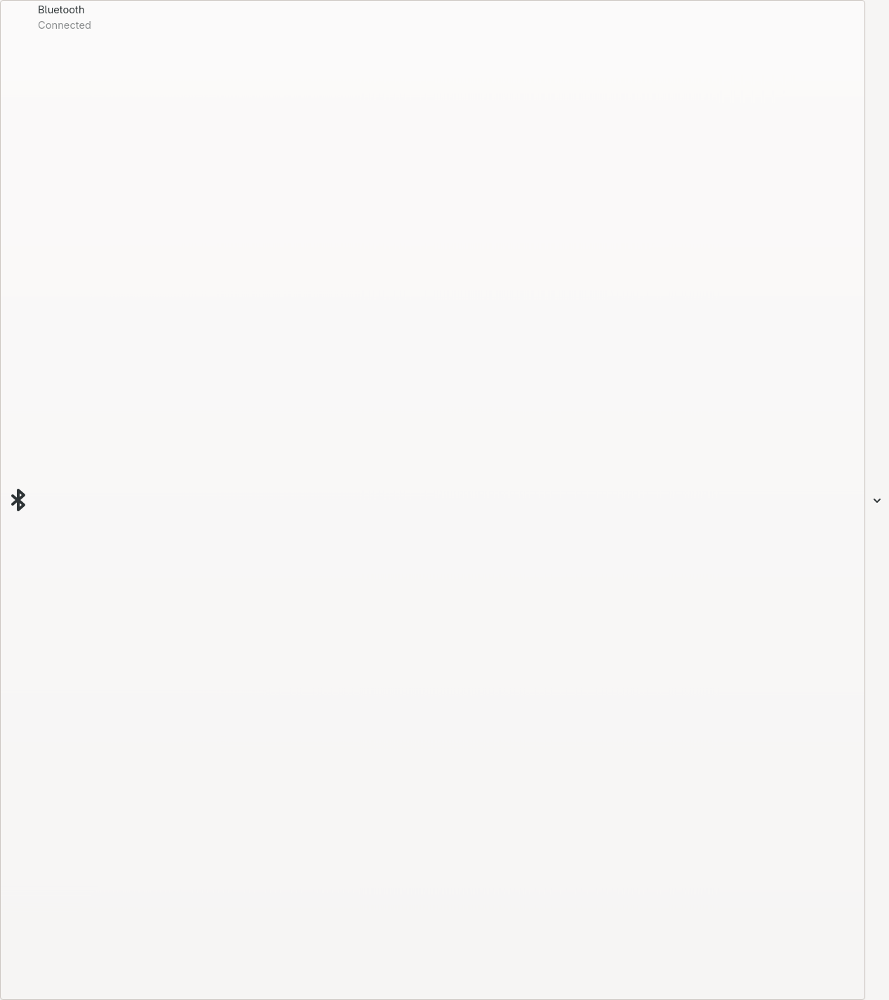

# Feature Toggle

A toggleable feature card with optional expanded content

## States

- [Inactive](#inactive)
- [Active](#active)
- [With Details](#with-details)
- [Busy](#busy)
- [Expandable](#expandable)
- [Active Expandable](#active-expandable)
- [Expanded](#expanded)

## Inactive

Basic inactive state

## Active

Active state (feature is enabled)

## With Details

Active with details text

## Busy

Busy state (operation in progress)

## Expandable

Inactive but expandable (shows chevron)

## Active Expandable

Active and expandable

## Expanded

Expanded state showing child widgets (note: expansion state is handled by MenuStore at runtime)

