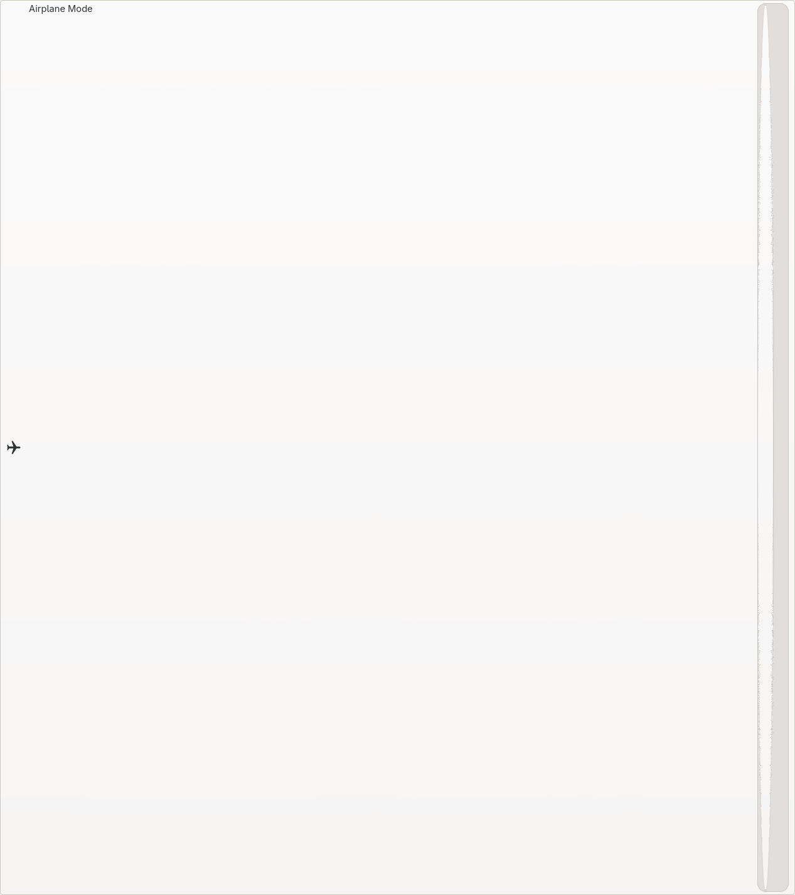

# Menu Row

A menu row with icon, labels, and optional trailing widget

## States

- [Basic](#basic)
- [With Icon](#with-icon)
- [With Sublabel](#with-sublabel)
- [With Switch](#with-switch)
- [With Checkmark](#with-checkmark)
- [With Spinner](#with-spinner)
- [Insensitive](#insensitive)

## Basic

Basic row with label only

## With Icon

Row with icon

## With Sublabel

Row with icon and sublabel

## With Switch

Row with trailing switch

## With Checkmark

Row with trailing checkmark

## With Spinner

Row with trailing spinner

## Insensitive

Disabled/insensitive row

