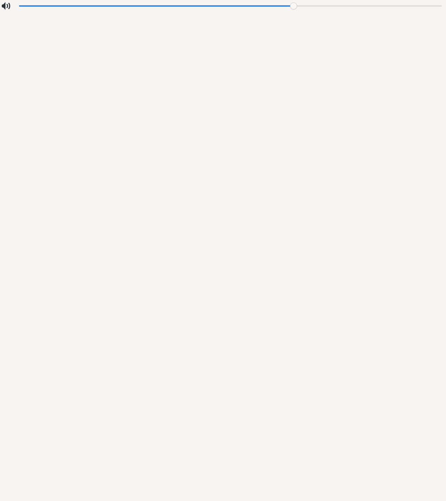
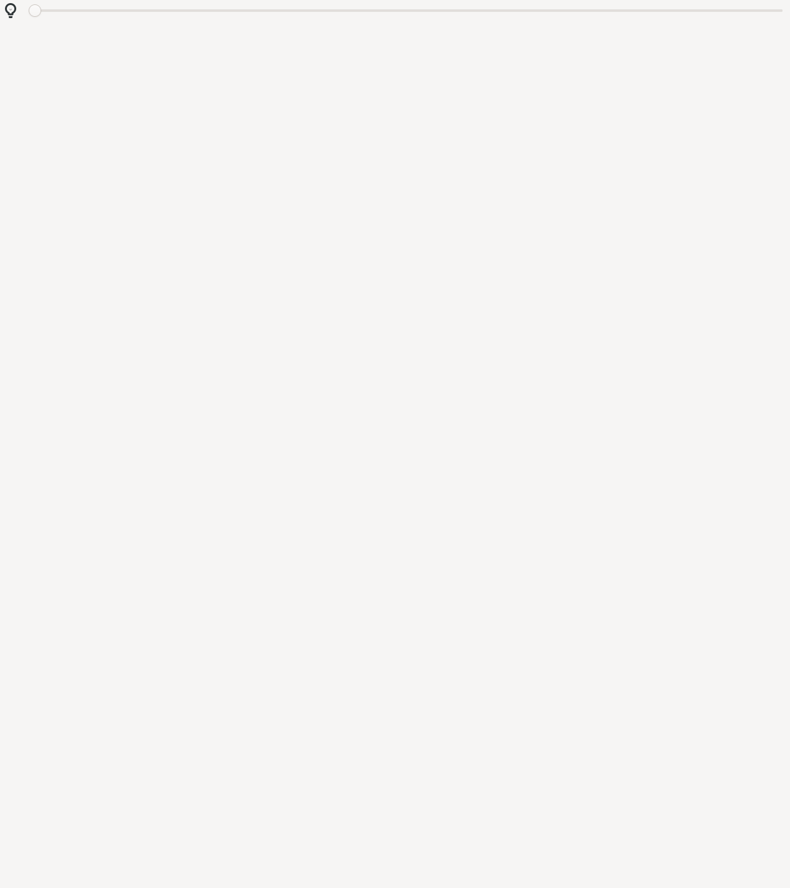
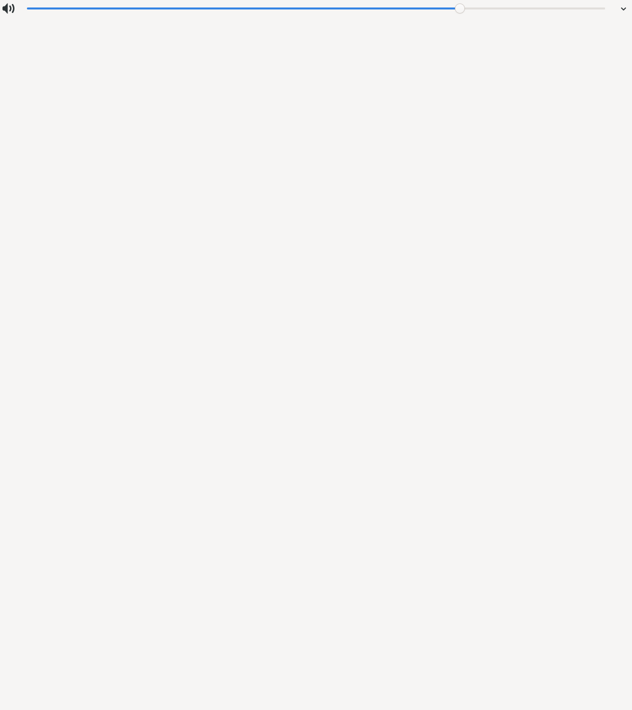

# Slider

A slider control with icon and optional expanded content

## States

- [Normal](#normal)
- [Muted](#muted)
- [Expandable](#expandable)

## Normal

Normal state with value

## Muted

Muted state (icon changes semantically)

## Expandable

Expandable slider with child content

